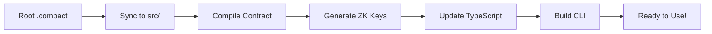

# 🌙 Midnight Smart Contract Scaffold

[](https://midnight.network)
[](https://typescriptlang.org)
[](https://nodejs.org)
[](LICENSE)

**The complete development scaffold for Midnight smart contracts.** Write your `.compact` contract and instantly get a full development environment with zero configuration. The system automatically generates a dynamic CLI, handles deployment pipelines, manages wallet operations, and provides a complete testing framework.


**🚀 From contract to production in minutes, not hours.**

## ✨ What You Get

- 🔄 **Auto-generating CLI** that adapts to your contract functions
- 🌐 **Seamless testnet deployment** with automated wallet management
- 💰 **Built-in wallet tools** for balance checking and faucet requests
- 📊 **Smart contract analysis** with automatic type generation
- 📝 **Comprehensive documentation** and debugging guides


## 🚀 Quick Start

**Get started with Midnight development in under 2 minutes:**

```bash
# Clone the scaffold
git clone https://github.com/kaleababayneh/scaffold-midnight.git
cd scaffold-midnight

# Install dependencies
npm install

# Create your first contract
touch my-contract.compact
# set up your wallet env
mv .env.example .env

# Deploy and test (one command!)
npm run deploy
```

### 📋 Prerequisites

**System Requirements:**
- **Node.js 20**
- **Compact Compiler**
- **Docker Desktop** 

### 📝 **Write Your First Contract**

Edit your `.compact` file in the project root:
```compact
pragma language_version 0.15;

import CompactStandardLibrary;

export ledger counter: Counter;

export circuit increment(value: Uint<16>): [] {
  counter.increment(value);
}

export circuit get_count(): Uint<64> {
  return counter;
}
```

### 🎯 **Generate Everything Automatically**

```bash
npm run dev
```

This single command:
- 🔄 Syncs your contract to the build system
- 🔨 Compiles contract and generates ZK keys
- 📝 Creates TypeScript types and API functions  
- 🖥️ Builds a dynamic CLI that adapts to your contract
- ✅ Everything ready to use!

### 🚀 **Deploy & Test**

**For testnet deployment:**
```bash
npm run wallet
```

## 🚀 Features

### ✨ **Zero-Configuration Development**
- **Auto-Detection**: Automatically finds and analyzes your `.compact` contracts

- **Zero Manual Updates**: Change functions → regenerate → everything adapts automatically
- **Smart Contract Analysis**: Works with any contract structure and function names
- **Witness Function Support**: Automatically detects and includes private state functions

### 🌐 **Complete Deployment Pipeline**
- **One-Command Local Deployment**: `npm run deploy` for full local development setup
- **Docker Integration**: Automatically manages local Midnight node containers
- **Testnet Deployment**: Seamless testnet integration with `npm run wallet`
- **Dry Run Support**: Preview deployment with `--dry-run` flag

### 🔧 **Developer-Friendly Workflow**
- **Root-Level Editing**: Edit contracts directly in project root for easy access
- **Auto-Sync Pipeline**: Automatically syncs contracts to build directories
- **Clean Builds**: Removes old artifacts before rebuilding
- **Hot Reload**: Instant updates when contract changes
- **Comprehensive Compilation**: Handles ZK proof generation and TypeScript building

### 💰 **Wallet & Balance Management**  
- **Automatic Wallet Generation**: Creates secure wallets with one command
- **Balance Checking**: Real-time testnet balance monitoring
- **Faucet Integration**: Automated and manual token requesting
- **Transaction Management**: Full transaction lifecycle support

## 📁 Project Structure

```
example-counter/
├── my-contract.compact          # 📝 Edit your contract here (root level)
├── package.json                 # 📦 Main project configuration
├── .env                        # 🔐 Wallet configuration (auto-generated)
├── boilerplate/
│   ├── contract/               # 🔨 Contract compilation workspace
│   │   └── src/               # 📄 Auto-synced contracts & witnesses
│   │       ├── my-contract.compact    # ← Synced from root
│   │       ├── witnesses.ts           # 🔑 Private state functions
│   │       └── managed/               # 🏗️ Compiled output & ZK keys
│   ├── contract-cli/          # 🖥️ Generated CLI application
│   │   ├── src/              # 🎯 Dynamic CLI code
│   │   │   ├── api.ts        # 🔌 Contract interaction API
│   │   │   ├── cli.ts        # 🖥️ Interactive CLI interface
│   │   │   └── enhanced-api.ts # 📊 Contract metadata & analysis
│   │   └── standalone.yml    # 🐳 Docker configuration for local node
│   └── scripts/              # ⚙️ Build & deployment automation
│       ├── auto-generator.js # 🔄 Core auto-generation engine
│       ├── deploy.js         # 🚀 Deployment orchestrator
│       ├── check-balance.js  # 💰 Wallet balance checker
│       └── request-faucet.js # 🚰 Testnet token requests
└── README.md                   # 📖 This documentation
```

### 🔄 **How the Auto-Sync Works**

1. **📝 Edit**: Modify your `.compact` contract in the project root
2. **🔄 Sync**: `npm run dev` copies it to `boilerplate/contract/src/`
3. **🔨 Compile**: Contract compiles to `managed/` with ZK keys
4. **📝 Generate**: TypeScript types and API functions auto-generated
5. **🖥️ Build**: CLI updates with new contract functions
6. **✅ Ready**: Everything synchronized and ready to use

## 🔄 Development Workflow

### **1. Edit Contract (Root Level)**
```bash
# Edit your contract file in the project root  
nano my-contract.compact  # Use any editor you prefer
```

### **2. Auto-Generate Everything**
```bash
npm run dev
```

This command automatically:
- 🔄 Syncs your contract from root to build directory
- 🔨 Compiles contract with `compactc` and generates ZK keys  
- 📝 Updates TypeScript types and API functions
- 🖥️ Rebuilds CLI with new contract functions
- 🔍 Detects witness functions and includes them
- ✅ Everything synchronized and ready!

### **3. Deploy & Test**

**Local Development (Recommended):**
```bash
npm run deploy
```
- Starts local Midnight node in Docker
- Deploys your contract locally
- Launches interactive CLI for testing

**Testnet Deployment:**
```bash
npm run wallet
```
- Connects to live Midnight testnet
- Handles wallet creation and funding
- Deploys to public testnet

### **4. Iterate and Improve**
```bash
# Make changes to your contract
vim my-contract.compact

# Regenerate CLI (fast)
npm run dev

# Test changes
npm run deploy
```

## 🔧 Troubleshooting

### 🚨 Common Issues & Solutions

| Issue | Symptoms | Solution |
|-------|----------|----------|
| **Contract not detected** | "No .compact files found" | Ensure `.compact` file is in project root |
| **Compilation errors** | Build fails, ZK key generation errors | Check `pragma language_version` directive |
| **CLI generation failed** | Missing menu options | Verify `export circuit` function syntax |
| **Docker issues** | Local deployment fails | Ensure Docker Desktop is running |
| **Testnet connection** | Wallet sync timeouts | Check internet connection, try `npm run balance` |
| **Zero balance** | Deployment fails with "insufficient funds" | Run `npm run faucet` or use manual faucet |
| **Permission errors** | File system access denied | Run `sudo npm run deploy` or fix file permissions |

### 🔍 Debug Commands

```bash
# Check system requirements
node --version && docker --version && git --version

# Verify contract syntax
npm run build

# Check wallet status
npm run balance

# View detailed logs
npm run deploy --dry-run

# Test local environment
docker ps
```

## 🎛️ Commands Reference

| Command | Purpose | Environment |
|---------|---------|-------------|
| `npm run dev` | 🔄 Regenerate CLI from contract changes | Local |
| `npm run deploy` | 🚀 Deploy to Midnight testnet | Testnet |
| `npm run wallet` | 🌐 🔐 Generate new wallet seed and address | Testnet |
| `npm run balance` | 💰 Check current wallet balance | Testnet |
| `npm run faucet` | 🚰 Request testnet tokens | Testnet |
| `npm run build` | 🔨 Build all workspaces | Local |

## 🚀 Deployment Guide


**Quick testnet deployment:**
```bash
npm run deploy
```

This command:
1. 🔨 Compiles your contract and generates CLI
3. 📦 Deploys contract to midnight testnet network
4. 🎯 Launches interactive CLI for testing

### 🌐 Testnet Deployment

**Interactive testnet deployment:**
```bash
npm run wallet
```

**Automated testnet deployment:**
```bash
# Deploy new contract automatically
npm run deploy --new

# Join existing contract
npm run deploy --join

# Preview commands (dry run)
npm run deploy --dry-run
```

### 🔧 Deployment Flags

| Flag | Behavior | Use Case |
|------|----------|----------|
| `--new` | Auto-deploy new contract | CI/CD pipelines |
| `--join` | Auto-join existing contract | Team collaboration |
| `--dry-run` | Preview commands only | Testing scripts |
| `--help` | Show detailed help | Documentation |


## 🏗️ How It Works

### **Auto-Detection System**
The system automatically:

1. **Scans** the root directory for `.compact` files
2. **Copies** them to the contract source directory (replacing old ones)
3. **Analyzes** contract functions and ledger state
4. **Generates** TypeScript types and API functions
5. **Builds** a dynamic CLI that adapts to your contract

### **Function Discovery**
```javascript
// Automatically detected from your contract:
export circuit increment(value: Uint<16>): [] { ... }
export circuit get_count(): Uint<64> { ... }

// Becomes CLI options:
// 1. Increment (1 param)
// 2. Get Count (read-only)
```

### **Smart CLI Generation**
- **Parameter Detection**: Automatically detects function parameters
- **Type Safety**: Generates TypeScript interfaces
- **Read-Only Functions**: Identifies and marks query functions
- **Interactive Menus**: Creates numbered options for all functions

## ⚙️ Advanced Configuration

### 🎨 Custom Contract Examples

**Voting Contract:**
```compact
pragma language_version 0.15;
import CompactStandardLibrary;

export ledger votes: VotingState;

export circuit vote_for(candidate: Uint<8>): [] {
  votes.vote(candidate);
}

export circuit get_results(): VotingResults {
  return votes.getResults();
}
```

### 🔧 Environment Variables

Create a `.env` file for configuration:

```bash
# Wallet Configuration
WALLET_SEED=your-64-character-hex-seed-phrase
WALLET_ADDRESS=your-wallet-address


## 💰 Wallet Management

### 🔐 Wallet Creation

**Option 1: Auto-generate wallet (Recommended)**
```bash
npm run wallet
```

**Option 2: Manual setup**
```bash
# Copy example configuration
cp .env.example .env

# Edit .env file and add your seed
WALLET_SEED=your-64-character-hex-seed-phrase-here
```

### 💰 Balance Checking

**Check wallet balance:**
```bash
npm run balance
```

### 🚰 Getting Testnet Tokens

**Automated faucet request:**
```bash
npm run faucet
```

## 🛠️ Architecture

### **Auto-Generator Pipeline**


### **CLI Components**
- **Contract Analyzer**: Parses contract functions and types
- **Dynamic Generator**: Creates CLI menus and handlers
- **API Layer**: Handles contract interactions
- **Wallet Integration**: Manages testnet connections


## 🤝 Contributing

We welcome contributions! Here's how to get started:

### 📋 Contribution Guidelines

**Types of contributions welcome:**
- 🐛 **Bug fixes** - Fix issues with the scaffold
- ✨ **New features** - Add functionality to improve developer experience
- 📚 **Documentation** - Improve guides, examples, and API docs
- 🎨 **UI/UX** - Enhance CLI interface and user experience
- 🧪 **Tests** - Add test coverage and improve reliability


## 📊 Project Status

| Feature | Status | Notes |
|---------|--------|-------|
| ✅ Auto-CLI Generation | Complete | Supports all contract types |
| ✅ Local Development | Complete | Docker-based Midnight node |
| ✅ Testnet Deployment | Complete | Automated wallet management |
| ✅ Deployment Flags | Complete |  |
| ✅ Wallet Tools | Complete | Balance checking, faucet |
| ✅ Documentation | Complete | Comprehensive guides |
| 🔄 Multi-Contract Support | Planned | Support multiple contracts |
| 🔄 GUI Interface | Planned | Web-based contract interaction |
| 🔄 Contract Templates | Planned | Pre-built contract examples |

**Last Updated**: June 13, 2025  
Built with ❤️ for the Midnight ecosystem 🌙

Empowering developers to build privacy-preserving applications with zero-knowledge proofs.